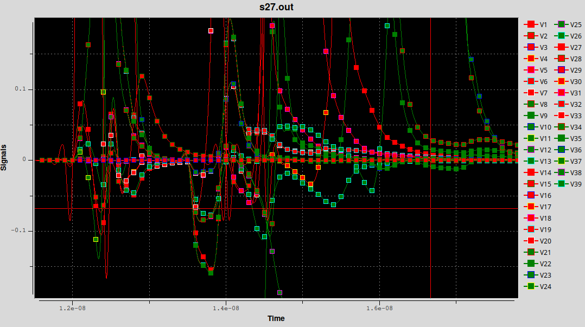
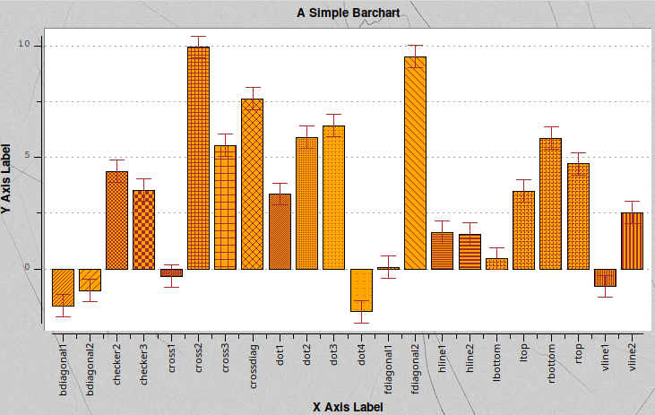
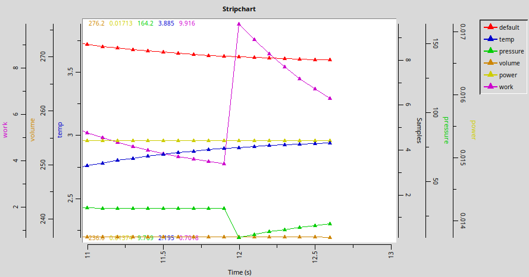
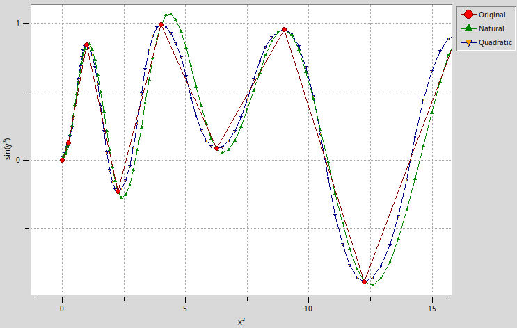
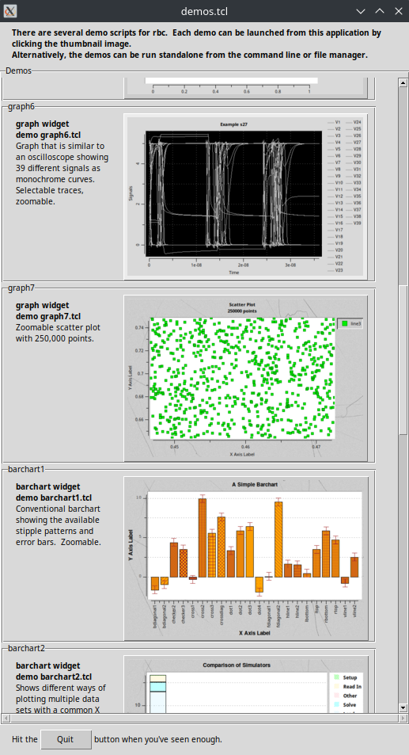

# Rbc - Refactored BLT Components

This is version 0.2 of the Rbc library.  It should be considered alpha quality software.

Rbc is an extension of the Tcl/Tk toolkit and contains refactored components from version 2.4z of the BLT library.
These components were refactored so that they would function with version Tcl/Tk 8.5.

Later, it was updated by Emiliano Gavilán to work with Tcl/Tk 9.0.

This is my personal fork of Emiliano [repository](https://chiselapp.com/user/egavilan/repository/rbc-tk9). 

This fork differences are:

- Change documentation format to Markdown.
- Formatting of C-code (cosmetic changes) and removal of K&R deprecated function definitions.
- Updated demos
- Additional functionality in `graph.tcl` library.

Also I am going to apply any further improvements from Emiliano repository.

Rbc is available from:
	https://github.com/georgtree/rbc-tk9
	
More information on BLT is available from:
	http://www.sourceforge.net/projects/blt/files
	
Rbc is intended to work with Tcl/Tk versions 8.7 and 9.0, although it may work with others. Rbc is a TEA compliant
extension, although it is not (yet) entirely free of dependency on Tcl/Tk private structures. So, for compilation
you need Tcl/Tk sources.

Rbc is a subset of BLT, contains the essential components for developing data graphing applications.  Some BLT
components have been superseded by advances in Tcl and Tk, and some others have been extracted into separate extensions.
Rbc contains the following BLT components:

- graph, barchart, stripchart

  These components use an X-Y coordinate system to plot data and are meant to be used with vector data objects. The
  graphs will automatically be redrawn should the vector data change.
  
  Example of graph (`graph4.tcl` from demos):
  
  
  
  Example of barchart (`barchart1.tcl` from demos):
  
  
  
  Example of stripchart (`stripchart1.tcl` from demos):
  
  

- vector

  This component is used to manage floating point values. They are meant to be used to handle data for the plotting
  components.
  
- spline

  This component is used to manage spline approximation of the data.
  
  Example of spline approximation (`spline1.tcl` from demos):
  
  

- winop

  This component provides basic window operations.

## Installation

For binary installations, just unzip or untar the package into your Tcl library.

## Building from Source

Rbc is a TEA compliant extension.  You should be able to unpack the source code, and perform the usual configure/make
/make install procedure.  Making the test target will run the automated test suite.

Since Rbc still depends on some Tcl/Tk private data structures, you may experience some difficulty in bulding it against
some Tcl distributions which do not have the complete set of public and private headers.

Versions of Tcl/Tk lower than 9.0 are not tested.

## Documentation

Documentation could be found [here](https://georgtree.github.io/rbc-tk9/).

## Examples (demos)

To see the examples of usage, you can run file `demos.tcl` in demos folder after package installation:

```bash
wish ./demos/demos.tcl 
```

There you can select from the range of different usages through selection window:

  

## History (message from original RBC authors)

In order to fulfill degree requirements, the four of us undertook the refactoring of a few commonly used BLT components.
The project was proposed by an alumnus of the students' institute and was accepted by the school's Computer Science and
Software Engineering Department. The project began in the Fall of 2008 and culminated on the students' graduation in the
Spring of 2009.  In addition to refactoring parts of BLT, we also began developing a graphical data analysis tool that
is designed to work with Rbc (and BLT) and be easily extensible.  For more information see the GDAT project available
at: http://www.sourceforge.net/projects/gdat/

In keeping with the spirit of BLT, we have released this project to the open source community in hopes that you will
continue development and add more components from the BLT library that are compatible with version 8.5 and later of
Tcl/Tk.

sjg,njh,sjs,jms

